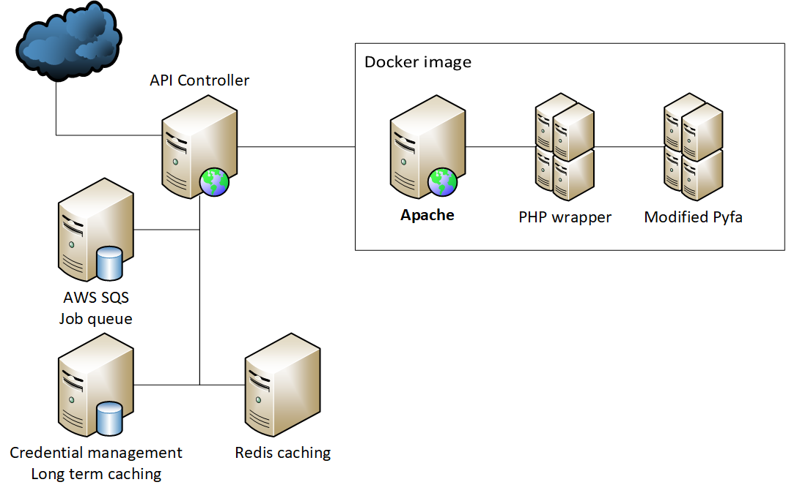

# About svcfitstat

This microservice takes a fit and returns its statistics using [CLI modified Pyfa](https://github.com/molbal/Pyfa) to do the calculations. 

The service exposes a REST webservice that is - for now - used internally  

# Architecture

##Components 
...
[image](https://github.com/molbal/svcfitstat-worker)

# Endpoints

...
# Database
...
